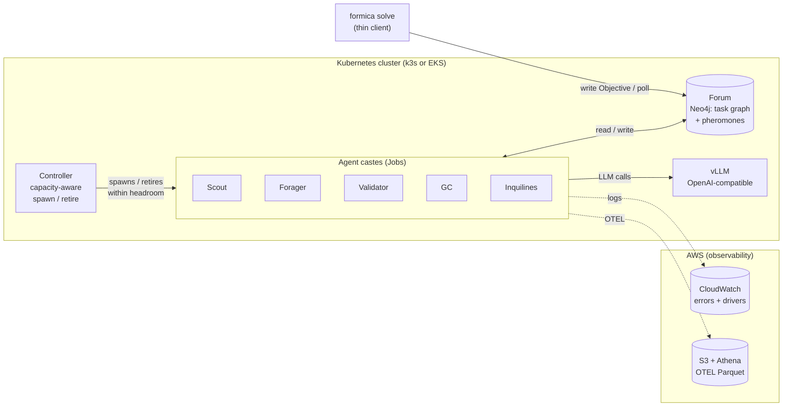

# Formica

**Formica** is a stigmergic, ant-colony-inspired multi-agent system for
autonomous problem solving. Agents do not message each other. They
coordinate by reading and writing a shared artifact: a typed task
graph with pheromone-weighted edges, stored in Neo4j.

> "Intelligence is a property of the colony, not the ant."

## What is Formica

- **Forum (blackboard).** Neo4j graph of sub-problems, partial
  solutions, evidence, and validations. This is the only coordination
  channel. No inter-agent HTTP.
- **Pheromones.** Per-edge scalars across six channels (`promising`,
  `validated`, `risky`, `needs-expert`, `dead-end`, `alarm`), each
  with its own evaporation half-life. Agents follow gradients.
- **Castes.** Scouts decompose problems. Foragers produce evidence.
  Validators judge it. A GC caste prunes stale branches. Inquilines
  are narrow specialists (citation checking, numeric sanity).
- **Role reallocation (Gordon's rule).** Agents re-specialize based on
  local encounter rates, so the colony rebalances without a central
  scheduler.
- **Phase cycling.** The colony alternates exploration and
  consolidation phases based on pheromone entropy.
- **Alarm propagation.** Fast, short-lived pheromone that preempts
  work on failure or hallucination.
- **Capacity awareness, never overprovisioning.** The spawn
  controller checks cluster headroom each tick and only schedules
  more Worker, Validator, or Judge pods when there is room for them.
  When headroom runs out it throttles, retires lower-priority pods,
  or waits - it never schedules past what the cluster can run. Nodes
  added at runtime are absorbed passively on the next tick.

### Architecture



Agents never talk to each other. Every arrow into or out of the
colony goes through the Forum (Neo4j) or the model server. The
controller's only job is to keep the right mix of pods running
within whatever cluster headroom happens to exist.

## Launch

Formica is Kubernetes-native end-to-end. The same manifests work on a
single box (bare [k3s](https://k3s.io/) installed as a systemd service)
and on a real EKS cluster. There is no separate Docker Compose stack,
no Docker-in-the-middle, and no in-process mode.

### Prerequisites

- `curl`, `systemd`, and root access to install k3s.
- For local GPU inference: an NVIDIA GPU with drivers and
  `nvidia-container-toolkit` installed, plus Mistral-7B-AWQ weights at
  `/opt/models/mistral-awq` on the host. (Skip this if you override to
  Bedrock or OpenAI via `FORMICA_MODEL_PROVIDER`.)
- For AWS observability: valid AWS credentials in the shell that runs
  `kubectl apply` (IRSA handles pod-level auth once deployed).

### Single box on EC2 (one command)

Launch a `g5.xlarge` on the rome AMI (`ami-079c82d610e02e480`) with a
**200 GB gp3 root volume** and an instance profile carrying
`AmazonSSMManagedInstanceCore`, then:

```bash
aws ssm start-session --target i-XXXXXXXXXXXXXXXXX --region us-east-1
sudo su - ec2-user
git clone https://github.com/abacus2000/formica.git ~/formica
cd ~/formica
bash scripts/launch-single-box.sh
```

The script installs k3s + the NVIDIA device plugin, builds
`formica:latest` into k3s's containerd store via BuildKit, deploys the
dev overlay, waits for everything to roll out, and runs a `formica
solve` smoke test. It takes ~10 minutes on a fresh instance, is
idempotent, and refuses to run on a root volume that cannot fit the
vLLM image.

Knobs: `SKIP_SMOKE=1` stops after the rollout. Full documentation,
including a manual step-by-step and troubleshooting, is in
[`docs/launch-on-aws.md`](docs/launch-on-aws.md).

### Submit more objectives

The launcher leaves port-forwards running and env vars exported in its
shell. From any new shell:

```bash
export KUBECONFIG=$HOME/.kube/config
export FORMICA_NEO4J_URI=bolt://localhost:7687
export FORMICA_MODEL_BASE_URL=http://localhost:8080/v1
kubectl -n formica port-forward svc/neo4j 7687:7687 &
kubectl -n formica port-forward svc/vllm  8080:8080 &

formica solve "Prove sqrt(2) is irrational" --budget 1 --timeout 600
```

Validated Evidence streams to stdout as Validator pods emit it.

### Watch the colony

```bash
kubectl -n formica logs -f deploy/formica-controller   # spawn/retire decisions
watch kubectl -n formica get pods                       # live caste mix
open http://localhost:7474                              # Neo4j browser
```

### Multi-node (EKS)

Same manifests, with a prod overlay that swaps the vLLM `hostPath` for
a PVC and sets IRSA annotations:

```bash
kubectl apply -k deploy/k8s/overlays/prod
formica solve "Prove sqrt(2) is irrational with three independent methods" \
  --budget 2 --timeout 600 --env prod --region us-east-1
```

Step-by-step EC2 recipe: [`docs/launch-on-aws.md`](docs/launch-on-aws.md).
Automated launcher: [`scripts/launch-single-box.sh`](scripts/launch-single-box.sh).
Conceptual walkthrough: [`docs/single-box.md`](docs/single-box.md).

## Observability

- **CloudWatch** (errors + driver logs):
  `/formica/{env}/{region}/errors`, `/formica/{env}/{region}/drivers`
- **S3 + Athena** (OTEL traces / metrics / logs as Parquet):
  `formica-otel-{env}-{region}`

See [`docs/observability.md`](docs/observability.md).

## Credits and inspiration

Formica's design draws on peer-reviewed work in multi-agent systems,
distributed algorithms, and ant colony biology. The annotated reading
list - with notes on which paper shaped which component - lives in
[`docs/references.md`](docs/references.md).

A few load-bearing sources:

- Rodriguez 2026, *Pressure Fields and Temporal Decay* - the core
  coordination model behind Formica's pheromone grid and decay.
- Garg, Shiragur, Gordon, Charikar 2023, *Distributed algorithms from
  arboreal ants* - shortest-path reinforcement on the evidence graph.
- Chandrasekhar, Gordon, Navlakha 2018, *Trail repair* - how the
  colony recovers after a pod is retired or a Validator fails.
- Prabhakar, Dektar, Gordon 2012, *Anternet* - outgoing-rate control
  tuned by return signals; Formica's Controller spawns new Workers by
  the same rule.
- Gordon & Mehdiabadi 1999, *Encounter rate and task allocation* -
  the local-interaction basis for Gordon's rule in the Controller.
- Friedman et al 2021, *Active Inferants* - active-inference framing
  for individual agents inside a stigmergic colony.

## License

[MIT](LICENSE)
