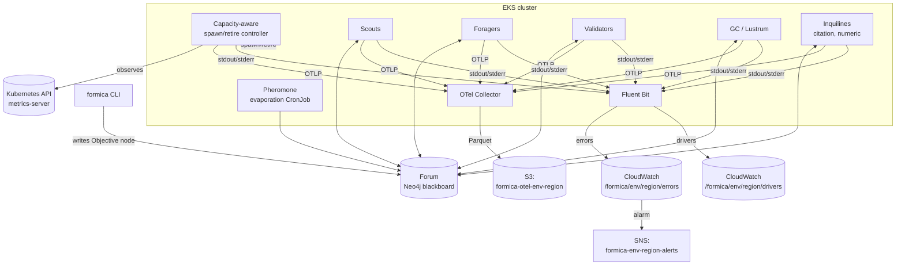

# Formica architecture

Formica is a colony of short-lived agents that solve problems by leaving pheromone
trails on a shared typed graph. There is no central dispatcher.

## Components



## The Forum (blackboard)

Neo4j graph. Node labels:

- `:Objective` - the top-level problem. One per `formica solve` invocation.
- `:SubProblem` - a decomposition; created by Scouts.
- `:Evidence` - a partial solution, quote, computation, or claim; written by Foragers.
- `:Validation` - a verdict on an Evidence node; written by Validators.
- `:Alarm` - a transient event (hallucination, tool failure, budget overrun).

Edge types:

- `(:SubProblem)-[:CHILD_OF]->(:Objective | :SubProblem)`
- `(:Evidence)-[:SUPPORTS]->(:SubProblem)`
- `(:Evidence)-[:REFUTES]->(:Evidence)`
- `(:Validation)-[:VERDICTS]->(:Evidence)`
- `(:Alarm)-[:ALARMS]->(*)`

Each edge carries a map of pheromone channels:

```cypher
(a)-[r:SUPPORTS {pheromones: [
  {channel: 'promising', value: 0.72, updated_at: 1713580000, half_life_s: 900},
  {channel: 'validated', value: 0.30, updated_at: 1713580100, half_life_s: 3600}
]}]->(b)
```

See [`docs/pheromones.md`](pheromones.md) for channel definitions.

## The agent tick

Every caste runs the same loop:

```
while not terminated:
    neighborhood = forum.read_local_neighborhood(self.focus_node, radius=2)
    action       = self.choose(neighborhood)    # samples by pheromone gradient
    outcome      = self.act(action)             # LLM + tools
    forum.write(outcome.node, outcome.edges, outcome.pheromones)
    controller.maybe_retire(self, encounter_rates=self.encounters)
```

Agents are **stateless between ticks**. Everything durable goes to the Forum.

## Castes

| Caste           | What it does                                     | Writes to                                  |
| --------------- | ------------------------------------------------ | ------------------------------------------ |
| Scout           | Creates new `SubProblem` nodes from unclaimed objectives; seeds `promising` | new nodes + edges |
| Forager         | Picks a `SubProblem` by gradient; produces `Evidence` | `Evidence`, `SUPPORTS` with `promising`    |
| Validator       | Verifies `Evidence` (unit test, consistency, citation) | `Validation` with `validated` or `dead-end` |
| Inquiline       | Narrow specialist - runs only when `needs-expert` or a specific pattern matches | depends                                    |
| GC (Lustrum)    | Prunes nodes whose all-channel pheromone sum is below threshold for N cycles | deletes                                  |

## Phase cycling

The controller periodically computes the global pheromone entropy across the
`promising` and `validated` channels. Two thresholds with hysteresis drive phase transitions:

- **Exploration phase**: raise `promising` spawn weight, lower validator spawn weight.
- **Consolidation phase**: raise validator and GC weights, lower scout weights.

Transitions are logged as `PhaseTransition` events.

## Termination

The CLI polls for `Evidence` nodes whose `validated` pheromone:

1. Exceeds `VALIDATED_THRESHOLD`, and
2. Has remained stable (|Δ| < ε) across `N_STABLE_CYCLES` consecutive evaporation cycles,
   and
3. Is linked (via `SUPPORTS`) to the Objective's subgraph.

When N such Evidence nodes exist (parameterized by problem), the CLI returns with
the provenance subgraph.
